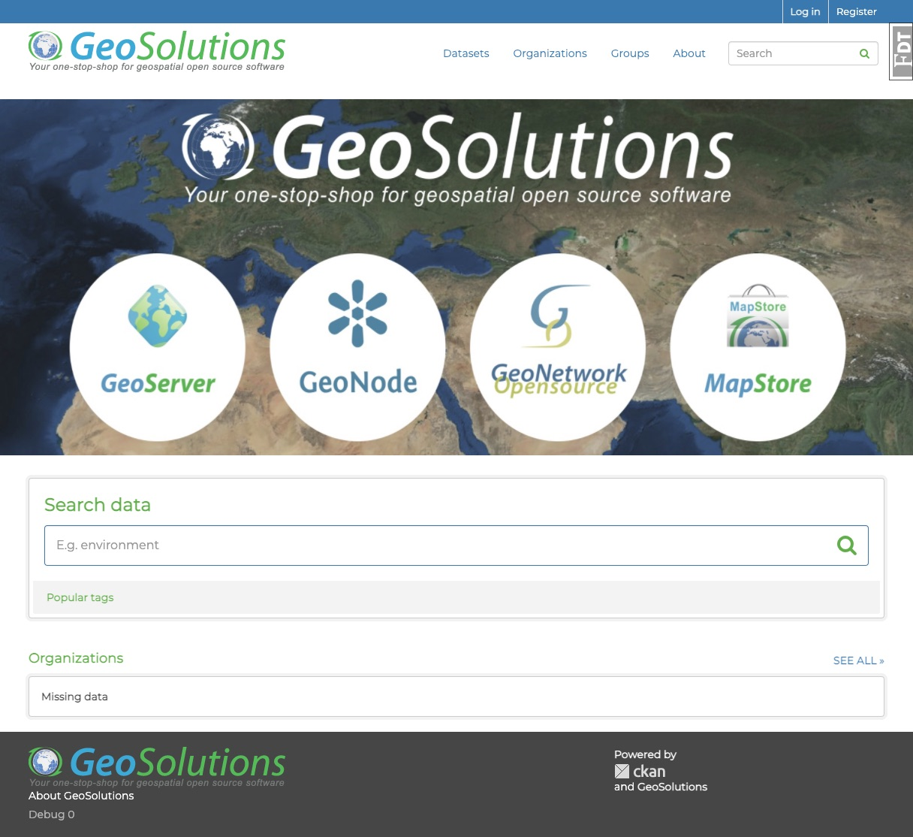
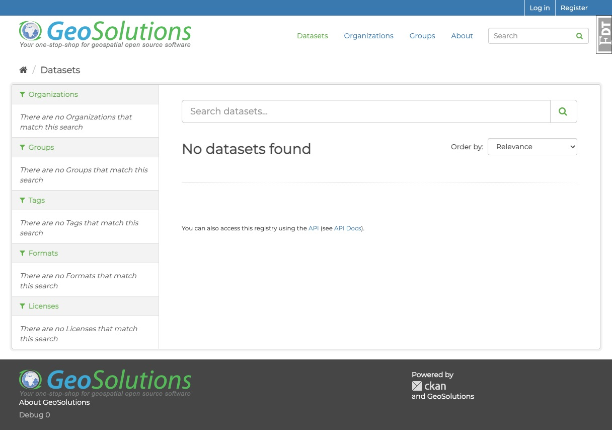

[](https://github.com/geosolutions-it/ckanext-geosolutions-ui/actions)

# ckanext-geosolutions-ui
**CKAN geosolution-ui** is a open-source template, to make easy the publish and development of Ckan frontend.

**Built With:**

[Jinja2](https://jinja.palletsprojects.com/en/2.11.x/)

[Bootstrap](https://getbootstrap.com/docs/3.3/)

[Less](http://lesscss.org/)






## Installation

### With CKAN virtualenv in Linux Machine

1. Activate your CKAN virtual environment, for example:
    ```
     . /usr/lib/ckan/default/bin/activate
    ```
2. Clone the source and install it on the virtualenv
    ```
    git clone https://github.com/geosolutions-it/ckanext-geosolutions-ui.git
    cd ckanext-geosolutions-ui
    pip install -e .
	pip install -r requirements.txt
    ```
3. Add `geosolutions-ui` to the `ckan.plugins` setting in your CKAN

    ```
    vim /etc/ckan/default/ckan.ini
    ```

4. Restart CKAN. For example if you've deployed CKAN with Apache on Ubuntu:
     ```
     sudo service apache2 reload
     ```

### With Docker

#### ckan docker setup
- install a ckan instance locally with docker (steps from ckan documentation https://docs.ckan.org/en/2.9/maintaining/installing/install-from-docker-compose.html)
#### add an extension inside docker of ckan
1. clone the geosolutions-ui extension repository
    ```
    cd /path/to/my/projects
    git clone --recursive https://github.com/geosolutions-it/ckanext-geosolutions-ui.git

    ```
2. to link ckan extension to ckan, create a file docker-compose.override.yml in /ckan/contrib/docker with the following code

    ```
    cd /path/to/my/projects/ckan/contrib/docker
    touch  docker-compose.override.yml

    ```
3. copy this configuration in docker-compose.override.yml
    ```
    version: '3'
    services:
    ckan:
        volumes:
        - '../../../ckanext-geosolutions-ui:/usr/lib/ckan/venv/src/ckanext-geosolutions-ui'

    ```
4. stop & start up the application

    ```
    docker-compose stop
    docker-compose up -d

    ```
5. get the id of the docker_ckan container with docker ps
    ```
    docker ps
    ```
6. attach the shell of the ckan docker container
    ```
    docker exec -it {my_docker_ckan_id} bash
    ```
7. activate the venv and navigate to the src folder inside the docker container
    ```
    #this command have to run inside docker
    source $CKAN_VENV/bin/activate && cd $CKAN_VENV/src/
    ```
8. install the extension

    ```
    #this command have to run inside docker
    cd ckanext-geosolutions-ui
    pip install -e .
    ```
9. install ckan dev requirements
    ```
    #this command have to run inside docker
    cd ../ckan
    pip install -r dev-requirements.txt
    ```
#### enable development enviroment

1. add the plugin to the production.ini config

    ```
    #this command have to run inside docker
    vim /etc/ckan/production.ini
    ```
2. append the name of plugin in the list and set debug equal true (both are in the file)

    ```
    debug = true
    ....

    ckan.plugins = stats text_view image_view recline_view geosolutions_ui
    ```
3. detach from docker container bash shell and restart ckan docker

    ```
    docker-compose restart ckan
    ```
## Usage

- inside Frontend directory
    ```
    cd ckanext-geosolutions-ui/ckanext/geosolutions_ui/
    ```
- folder tree
    ```
    ├── __init__.py
    ├── __init__.pyc
    ├── i18n
    ├── less
    │   ├── custom.less
    │   ├── main.less
    │   └── variables.less
    ├── package-lock.json
    ├── package.json
    ├── plugin.py
    ├── plugin.pyc
    ├── public
    │   └── base
    │       ├── css
    │       │   └── main.css
    │       └── img
    │           ├── jumbotron_hp.jpg
    │           └── logo.png
    └── templates
        ├── base.html
        ├── footer.html
        ├── header.html
        └── home
            ├── index.html
            ├── layout.html
            └── snippets
                ├── item.html
                ├── search.html
                └── topics.html
    ```

- install npm dependecies
    ```
    npm install
    ```

- run less compiler
    ```
    npm run watch-less
    ```
Start to customize

1. Style

In the less folder, is possibile change the less variables, to have a basic style customization.

- less/variables.less

    ```
    @brandDefaultColor: #fff;
    @brandPrimaryColor: #3A79AF;
    @brandSecondaryColor: #f3f3f3;
    @brandNotificationColor:#62AE4A;
    @bodyTextColor:#464646;
    @brandNotificationColorTransparency: rgba(58, 121, 175, 0.9);
    @jumbotronBg: '../../../base/img/jumbotron_hp.jpg';
    @jumbotronBgSize: 1224px 613px;
    @jumbotronBgPosition: center -40px;
    @jumbotronMinHeight: 410px;
    @bgPath: e("");
    @layoutFontFamily: "Helvetica Neue", Arial, sans-serif;
    ```
2. Logo

To change the logo file, in header and footer override the file

- public/base/img/logo.png 
 
or change the logo var in

- templates/footer.html 
- templates/header.html

    ```
        
    ```

3. Change footer info

    templates/footer.html change this var

    ```
        
        
        
        
        
        
    ```
4. Minimize main.css file

    ```
        npm run compile-css
    ```


## Tests

To run the tests, do:
    ```
    pytest --ckan-ini=test.ini
    ```

## Releasing a new version of ckanext-geosolutions-ui

If ckanext-geosolutions-ui should be available on PyPI you can follow these steps to publish a new version:

1. Update the version number in the `setup.py` file. See [PEP 440](http://legacy.python.org/dev/peps/pep-0440/#public-version-identifiers) for how to choose version numbers.

2. Make sure you have the latest version of necessary packages:

    pip install --upgrade setuptools wheel twine

3. Create a source and binary distributions of the new version:

       python setup.py sdist bdist_wheel && twine check dist/*

   Fix any errors you get.

4. Upload the source distribution to PyPI:

       twine upload dist/*

5. Commit any outstanding changes:

       git commit -a
       git push

6. Tag the new release of the project on GitHub with the version number from
   the `setup.py` file. For example if the version number in `setup.py` is
   0.0.1 then do:

       git tag 0.0.1
       git push --tags

## License

[AGPL](https://www.gnu.org/licenses/agpl-3.0.en.html)
